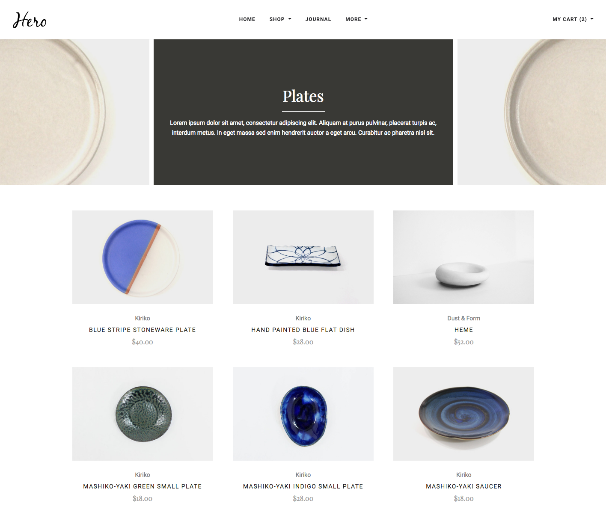
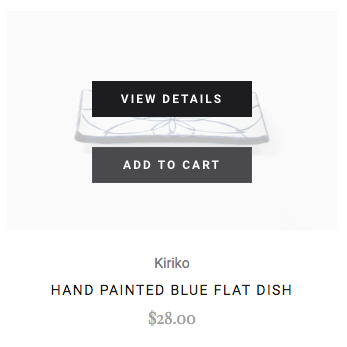
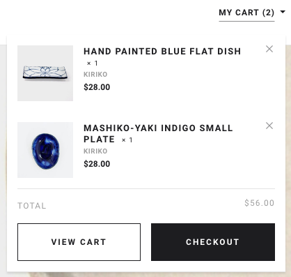
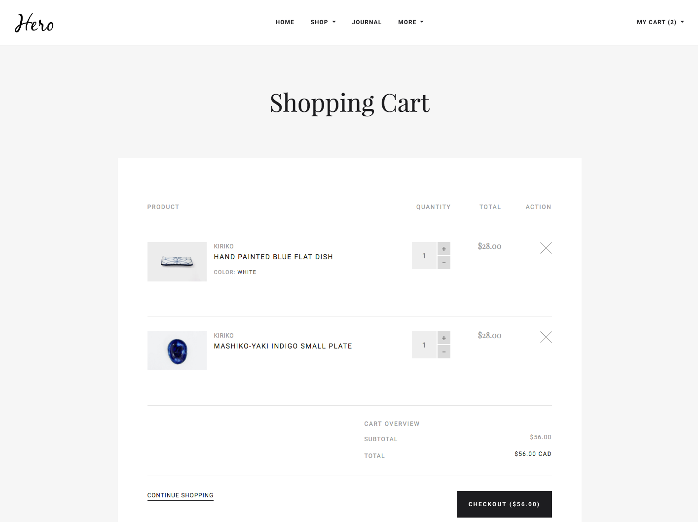

# REACT/REDUX SPA

Create a single-page app which renders a mock storefront that matches the provided screenshots, using the
supplied JSON and media files. The `products.json`.
* The storefront consists of three main screens: a category list page, a product details page, and a cart page. More
  details are provided below.
* Clicking the Add to Cart button on a product tile or on the product detail page should add the item to the cart
  dynamically.
* Attempting to add a duplicate item to the cart should instead increment the quantity for that item.
* It should be possible to change quantities and remove items on the cart page.
* Cart totals should update appropriately.

#### Category List page:

* Clicking the My Cart link should display the Cart Popup.
* Hovering over one of the product tiles should display an overlay prompting the user to Add to Cart or View Details,
  as below:



#### Cart Popup:

* You should be able to remove items from the cart using the popup.
* The View Cart button should take you to the cart page.
* The Checkout button does not need to do anything.
* When the popup is displayed, clicking anywhere outside it on the page should dismiss the popup.

#### Product details page:

* Clicking the My Cart link should display the Cart Popup.
* The quantity buttons should work as expected.
* Clicking Add to Cart should work as expected.

#### Cart page:

* Clicking the My Cart link should display the Cart Popup.
* The quantity buttons should work as expected, including updating the total for each line item and the cart total.
* The remove buttons should work as expected.
* The Continue Shopping link should return to the homepage.
* The Checkout button does not need to do anything.

### Instructions

Once installed, you should install the dependencies by running
```
npm install
```

To serve the application, run
```
npm start
```

To run the test suite, run
```
npm test
```
